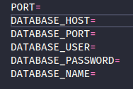
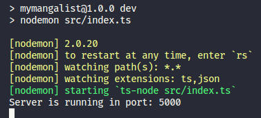
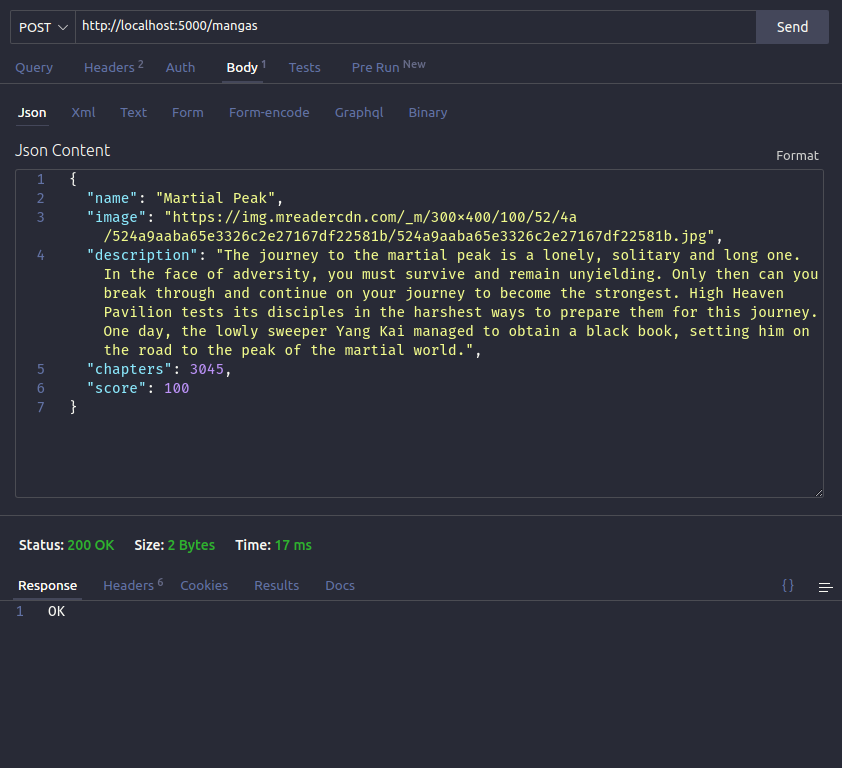
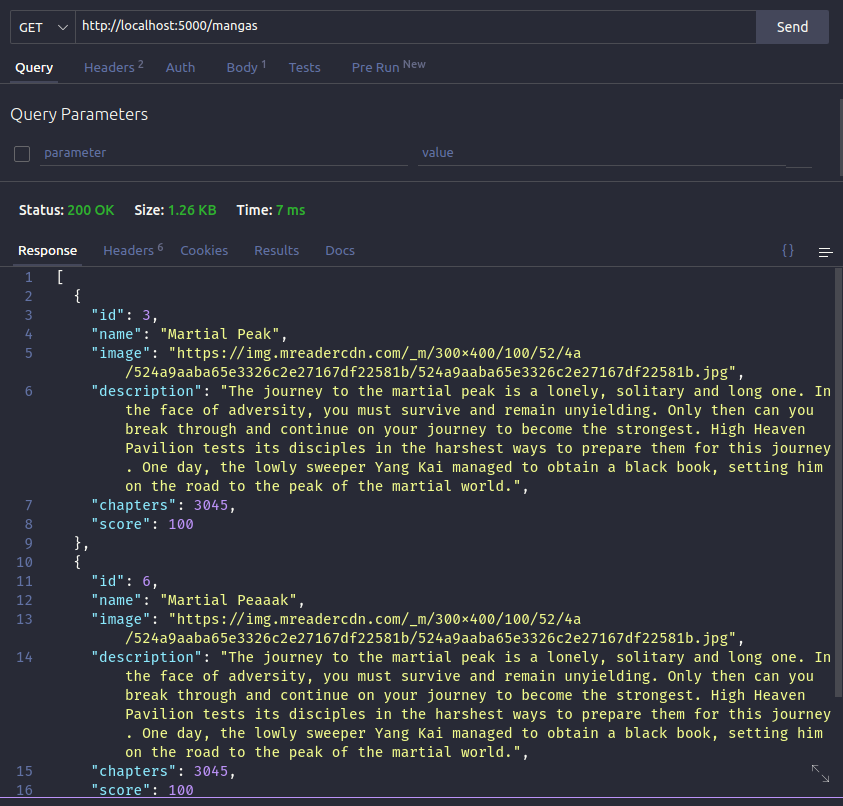
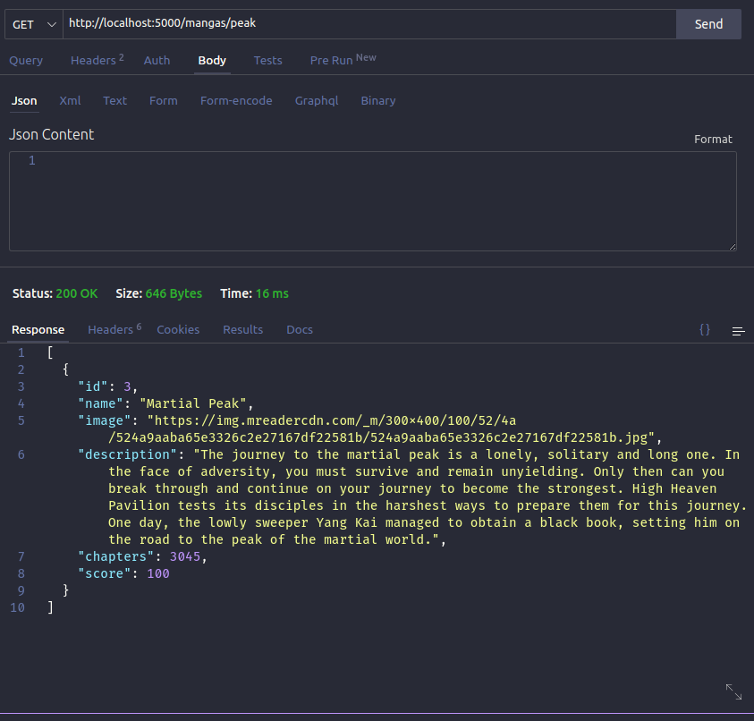
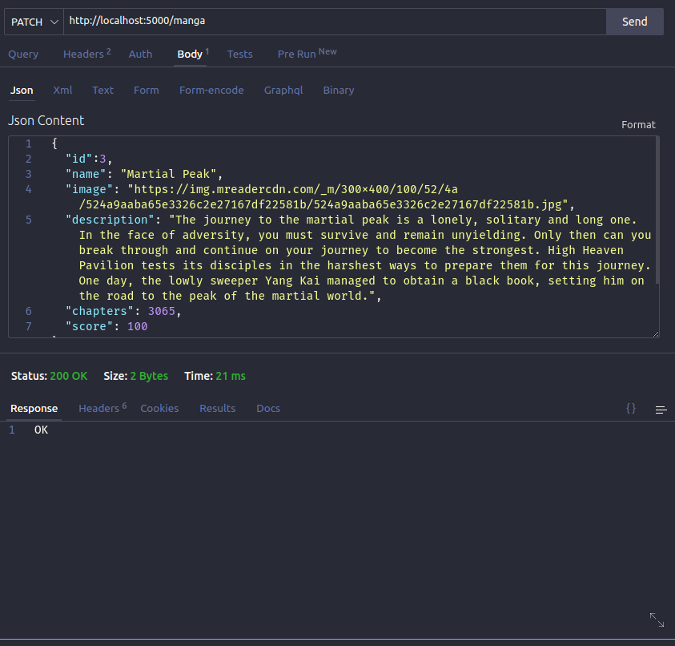
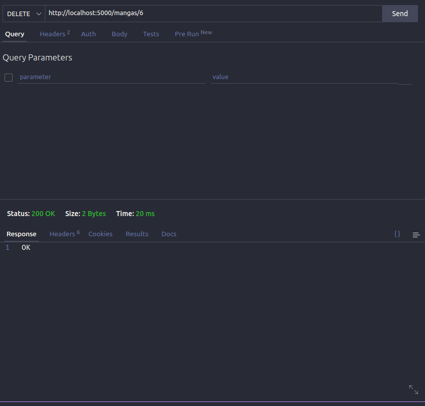
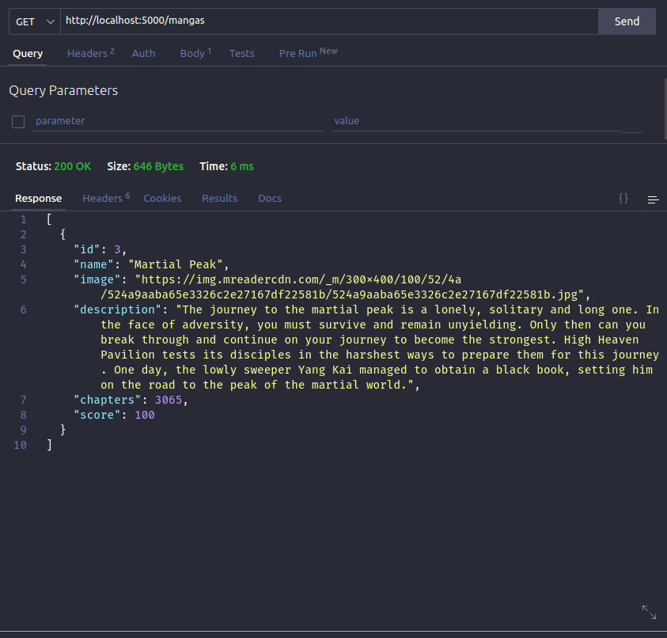

# MyMangaList

>This is the API behind a website where the users can add mangas, manhwas, manhuas and webtoons, their name, cover, score, description and number of chapters
>>In the future, members will have the possibility to add their own lists and mark what mangas they're reading and the last read chapter.

<br>

# How to run it (Version 1.0.0 using Postgresql)

## 1 - Clone this repository

```bash
git clone git@github.com:HugoNicolau/MyMangaList.git
```
> **Dont forget to star it :D**

## 2 - Install the dependencies

```bash
npm install
```
## 3 - Run dump.sql

>Run this code in your postgres manager to create the database

## 4 - Configure your .env

>Fill these fields



>Those configs are used in "db.ts"

## 5 - Run it

>Run the code
```bash
npm run dev
```
>It should have this result:



<br>

# Using it

>**Now the showcase of this application**

## Posting mangas(CREATING)



<hr>

## Getting mangas(Retrieving/Reading)



<hr>

## Getting specific mangas



<hr>

## Updating mangas



<hr>

## Deleting mangas



<hr>

## Getting again after the previous actions



<hr>

